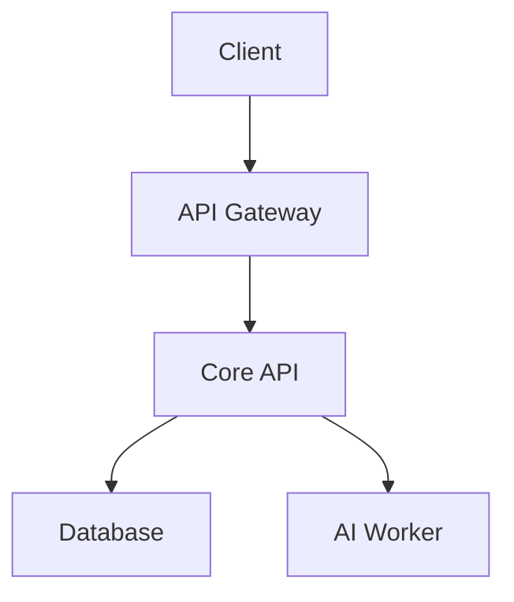

# {{title}}

## Overview
{{overview}}

## Objectives
- [ ] Objective 1
- [ ] Objective 2
- [ ] Objective 3

## User Stories
```dataview
TABLE user_story, priority
FROM "01-Projects/Active"
WHERE contains(file.tags, "user-story")
```

## Tech Stack
{{tech_stack}}

## Architecture



## Milestones

| Milestone    | Duration | Status |
| ------------ | -------- | ------ |
| M1: Setup    | 2 days   | [ ]    |
| M2: Core     | 3 days   | [ ]    |
| M3: Frontend | 3 days   | [ ]    |
| M4: Deploy   | 2 days   | [ ]    |


## Agent Log
```dataview
TABLE agent, action, timestamp
FROM "02-Agents/Logs"
WHERE project = this.file.name
SORT timestamp DESC
```

## Notes
{{notes}}
