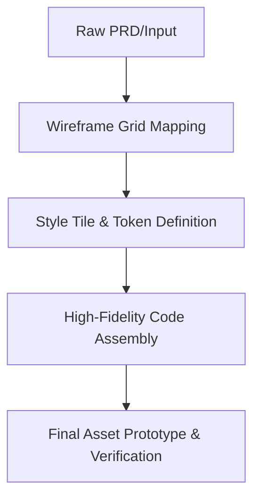

# Huashu Design Skill - Core Asset System & Design Protocols

The Huashu design skill orchestrates autonomous asset synthesis, high-fidelity mockups, multi-dimensional score reviews, and presentation exports.

## 1. Core Asset Protocol

### Brand Guidelines
- **Palette**: Neon Cyan (`#00f2ff`), Electric Blue (`#0077ff`), Dark Indigo (`#0a1929`), Deep Charcoal (`#050a0f`), Neon Coral (`#ff3333`).
- **Typography**: Inter (UI headers/body), JetBrains Mono (metrics/terminal stream).
- **Scale**: Geometric 8px grid scale for perfect alignments.
- **Visual Filters**: Sleek translucent panels with glassmorphism (`backdrop-filter: blur(10px)`).

---

## 2. Design Direction Advisor

Autonomous generators must optimize for exactly one of three distinct user experience directions:
1. **Minimal**: Ultra-clean spacing, spacious layouts, high contrast, typography-centric, high readability.
2. **Bold**: Vibrant conically gradiented panels, massive headlines, micro-animations, strong hover shadows.
3. **Technical**: Detailed HUD grids, code blocks, active vitals monitor widgets, status light clusters, terminal logs.

---

## 3. Junior Designer Workflow

All autonomous generation pipelines must follow this robust lifecycle:

1. **Wireframe**: Formulates layout blueprint without styles.
2. **Style Tile**: Configures typography, color cards, border radii.
3. **High-Fi Code**: Renders standard responsive component files.
4. **Verification**: Asserts layout completeness and compiles bundles.

---

## 4. 5-Dimension Review Framework

The final review board evaluates the synthesized assets across five core pillars, scoring each from `0` to `100`:

| Dimension | Scope of Evaluation | Target Benchmark |
| :--- | :--- | :---: |
| **Coherence** | Layout structure consistency, grid alignment, typography hierarchy. | > 85 |
| **Hierarchy** | Clear visual flow, primary CTA placement, layout scannability. | > 90 |
| **Craft** | Clean CSS structure, well-named custom classes, elegant hover states. | > 80 |
| **Function** | Component usability, fully interactive UI controls, mobile responsiveness. | > 95 |
| **Innovation** | Glassmorphism, creative gradient accents, premium HUD look-and-feel. | > 85 |

---

## 5. Export Pipelines

- **HTML/CSS/JS**: Export self-contained single-page apps (`.html`).
- **SVG**: Export interactive pulsing infographics (`.svg`).
- **PPTX**: Export structural slide decks (`.pptx`) with visual presentation formats.
